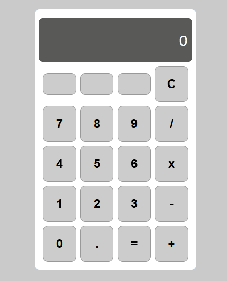

# 🧮 React Calculator - Operações Básicas & Histórico

Este é um projeto de calculadora desenvolvido em **React** como parte do currículo da Digital Innovation One (DIO). O diferencial desta implementação é o visor de histórico em tempo real, que permite ao usuário visualizar a expressão completa antes do resultado final.

<p align="center">
  
</p>

---

## 🚀 Funcionalidades

* **Operações Matemáticas:** Adição, Subtração, Multiplicação e Divisão.
* **Visor de Histórico:** Exibe a operação anterior (ex: `10 + 20 =`) acima do número atual, melhorando a experiência do usuário.
* **Controle de Estado:** Implementado com `useState` para gerenciar múltiplos valores e operadores.
* **Design Moderno:** Desenvolvido com **Styled Components** para garantir uma interface limpa e responsiva.

---

## 🛠️ Tecnologias

* [React](https://reactjs.org/)
* [Styled Components](https://styled-components.com/)
* [JavaScript (ES6+)](https://262.ecma-international.org/6.0/)

---

## ⚙️ Como executar o projeto

1.  Clone este repositório para o seu computador:
    ```bash
    git clone [https://github.com/ivoetana/calculadora-react-dio] (https://github.com/ivoetana/calculadora-react-dio)
    ```

2.  Entre na pasta do projeto:
    ```bash
    cd calculadora-react-dio
    ```

3.  Instale as dependências necessárias:
    ```bash
    npm install
    yarn install
    ```

4.  Inicie o servidor de desenvolvimento:
    ```bash
    npm start
    ```

A calculadora estará rodando em `http://localhost:3000`.

---

## 🌎 English Version

## 🧮 React Calculator - Basic Operations & History

A modern, responsive calculator built with **React** as part of the Digital Innovation One (DIO) bootcamp. This project features a clean UI and a real-time calculation history tracker above the main display.

### Features
* **Basic Arithmetic:** Addition, Subtraction, Multiplication, and Division.
* **Live History:** Displays the full operation (e.g., `10 + 20 =`) above the main display.
* **Responsive Design:** Styled components for a consistent look.
* **Input Validation:** Handles decimal points and basic arithmetic errors.

### Technologies
* React
* Styled Components
* JavaScript (ES6+)

---

### ✍️ Autor
Desenvolvido por **Ivo Emanuel Tana**.
